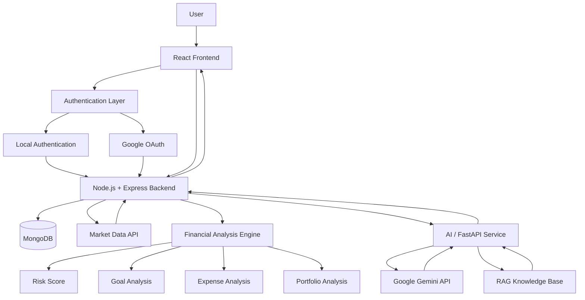
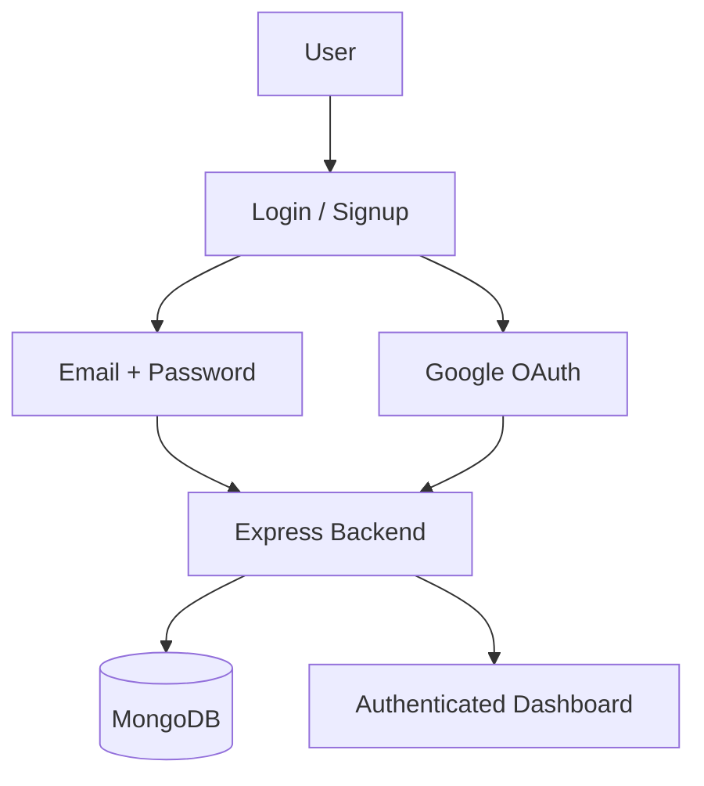
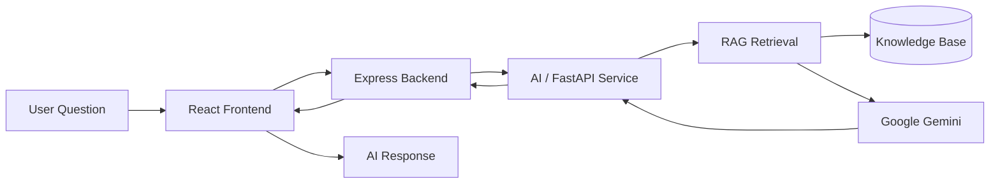
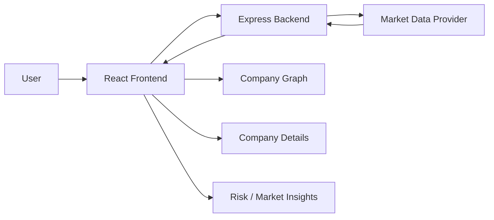
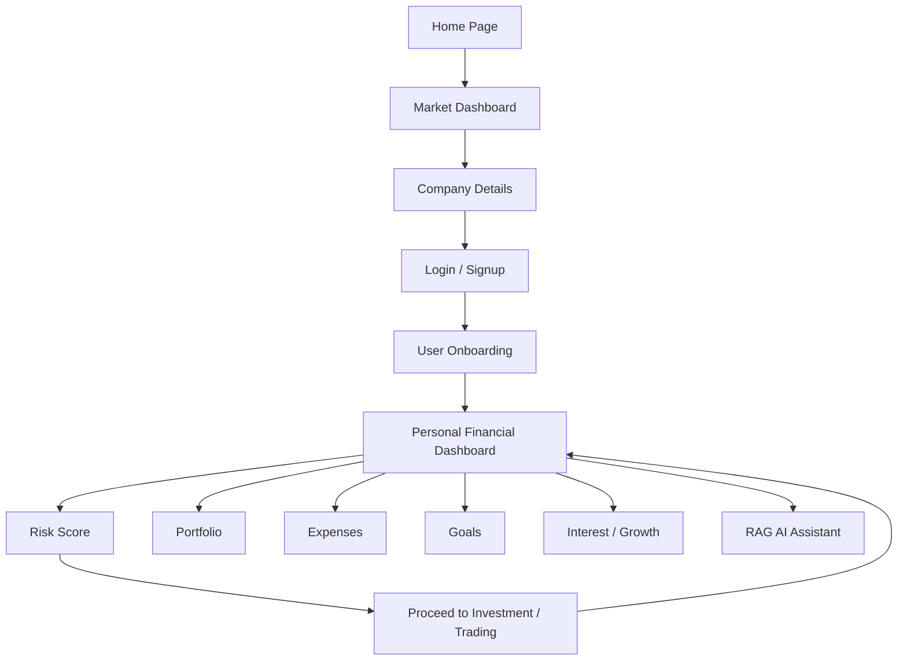

[README_StormBreakers.md](https://github.com/user-attachments/files/31331504/README_StormBreakers.md)
# 🌩️ StormBreakers — Understand Your Money. Understand the Market.

> A full-stack WealthTech platform designed to help users understand their financial health, analyze market opportunities, assess investment risk, manage expenses and goals, and interact with an AI-powered RAG assistant.

---

## 📌 Table of Contents

- [Overview](#-overview)
- [Problem Statement](#-problem-statement)
- [Our Solution](#-our-solution)
- [Key Features](#-key-features)
- [Team](#-team)
- [System Architecture](#-system-architecture)
- [How the Platform Works](#-how-the-platform-works)
- [Financial Analysis](#-financial-analysis)
- [AI + RAG](#-ai--rag)
- [Tech Stack](#-tech-stack)
- [Project Structure](#-project-structure)
- [Folder Architecture](#-folder-architecture)
- [Authentication](#-authentication)
- [Market Data Flow](#-market-data-flow)
- [Application Flow](#-application-flow)
- [Getting Started](#-getting-started)
- [Environment Variables](#-environment-variables)
- [API Overview](#-api-overview)
- [Security Considerations](#-security-considerations)
- [Future Scope](#-future-scope)
- [Contributing](#-contributing)
- [Team](#-team)

---

## Overview

**StormBreakers** is a WealthTech application built around a simple principle:

> **Understand Your Money. Understand the Market.**

The platform brings together personal financial analysis and market intelligence in a single application.

Users can:

- Explore company and market information.
- View company performance through interactive graphs.
- Understand financial risk through a calculated risk score.
- Track their portfolio.
- Monitor expenses.
- Set and monitor financial goals.
- Explore interest and financial-growth information.
- Receive AI-powered explanations.
- Ask questions about the platform and financial concepts using a **RAG-powered assistant backed by Google Gemini**.

The goal is not to replace professional financial advice. Instead, the platform is designed as an educational and decision-support system that makes financial information easier to understand.

---

# Problem Statement

Many new investors and young users find financial platforms difficult to understand because information is spread across different services.

Common challenges include:

- Difficulty understanding market data.
- Limited awareness of personal financial health.
- Lack of clarity around investment risk.
- Poor visibility into spending and expenses.
- Difficulty connecting financial goals with day-to-day decisions.
- Generic financial advice that is not connected to the user's context.
- Too much financial terminology and too little explanation.

StormBreakers addresses these challenges by combining **market intelligence, personal finance analysis, investment-oriented insights, and AI assistance** in one platform.

---

# Our Solution

StormBreakers provides a unified workflow:

**Market Understanding → Financial Understanding → Risk Analysis → Planning → AI Assistance**

The user can first explore market information, then log in and provide relevant financial details. The system uses these inputs to calculate financial indicators and provide a personalized dashboard.

The RAG assistant adds another layer by allowing users to ask questions in natural language and receive contextual answers based on the platform's knowledge base.

---

# Key Features

##  Market Intelligence

- Company-wise market information.
- Interactive company graphs.
- Company detail pages.
- Important market parameters.
- Risk-oriented information for individual companies.

##  User Authentication

StormBreakers supports:

- Local email/password registration.
- Local email/password login.
- Google OAuth login.
- User onboarding after authentication.

##  Financial Health Analysis

The platform analyzes user-provided financial information to calculate useful financial indicators.

Examples include:

- Income-related analysis.
- Expense-related analysis.
- Savings-related analysis.
- Debt burden analysis.
- Emergency-fund coverage.
- Goal progress.
- Investment risk compatibility.

##  Risk Score

A personalized risk score is generated from relevant financial parameters.

The purpose of the score is to make the user's financial position easier to understand rather than simply presenting raw numbers.

##  Portfolio

Users can view and manage portfolio-related information in one place.

##  Expense Tracking

Users can record and analyze expenses to understand their spending patterns.

##  Financial Goals

Users can create and track financial goals and monitor their progress.

##  Interest / Growth Analysis

The platform provides interest-related calculations and financial-growth information to help users understand how money can change over time.

##  Gemini + RAG Assistant

The platform includes an AI assistant powered by:

- **Google Gemini**
- **Retrieval-Augmented Generation (RAG)**

The assistant retrieves relevant information from the knowledge base before generating a response.

This allows the AI to answer questions about the platform and related financial concepts with greater contextual relevance.

---

# 👥 Team

| Member | Responsibility |
|---|---|
| **B V Karthik** | Financial analysis, risk-score logic, backend integration, overall system development |
| **Anjan Poojary** | Frontend experience, market/company interface, presentation and product flow |
| **Keerthi Jeevan** | AI, Gemini, RAG assistant and intelligent interaction layer |
| **Reavana Sidda** | Authentication, onboarding, frontend/backend integration and application support |

> Team responsibilities may overlap during development because the project was built collaboratively.

---

# 🏗️ System Architecture

StormBreakers follows a modular full-stack architecture separating the presentation layer, authentication, backend APIs, database, market-data integration, financial-analysis engine, and AI/RAG services.



---

##  Architecture Components

| Component | Responsibility |
|---|---|
| **React Frontend** | User interface, dashboard, graphs, portfolio, expenses, goals, risk analysis and AI assistant |
| **Local Authentication** | Registration and login using application credentials |
| **Google OAuth** | Google-based authentication and simplified login |
| **Node.js + Express** | Main backend, APIs, business logic and service integration |
| **MongoDB** | User data, financial details, goals, expenses, portfolio and application records |
| **Market Data API** | Company and stock-market data used by the dashboard |
| **Financial Analysis Engine** | Financial calculations and risk-score generation |
| **AI / FastAPI Service** | AI processing and communication with Gemini |
| **Google Gemini API** | Natural-language generation and AI reasoning |
| **RAG Knowledge Base** | Retrieves relevant context before AI response generation |

---

#  Authentication Architecture

StormBreakers supports both local authentication and Google OAuth.



### Local Authentication

The local authentication flow handles:

1. User registration.
2. Credential validation.
3. Secure password handling.
4. Login.
5. Session/authenticated access to application features.

### Google OAuth

Users can also choose Google OAuth for authentication.

This reduces the amount of information the user has to manually enter and provides a familiar authentication experience.

---

#  AI + RAG Architecture

The AI assistant is one of the central intelligent features of StormBreakers.



### How RAG Works

**RAG = Retrieval-Augmented Generation**

Instead of directly sending every question to the language model, the application can first identify relevant information from its knowledge base.

The overall process is:

1. User asks a question.
2. Frontend sends the question to the backend.
3. Backend forwards the AI request to the AI service.
4. RAG retrieves relevant information.
5. Retrieved context is provided to Gemini.
6. Gemini generates the response.
7. Response is sent back to the frontend.

### Why RAG?

RAG is useful because it can:

- Ground responses in known information.
- Improve contextual relevance.
- Reduce dependency on generic model knowledge.
- Allow the project knowledge base to be updated independently.
- Help the assistant answer questions about the application's own features.

---

#  Financial Analysis

StormBreakers uses financial calculations to transform raw user inputs into understandable indicators.

Examples of calculations that can be incorporated into the platform include:

### Savings Rate

```text
Savings Rate = (Income - Expenses) / Income × 100
```

### Expense Ratio

```text
Expense Ratio = Expenses / Income × 100
```

### Emergency Fund Coverage

```text
Emergency Coverage = Available Emergency Savings / Monthly Essential Expenses
```

### Debt Burden

```text
Debt Burden = Monthly Debt Payments / Monthly Income × 100
```

### Goal Progress

```text
Goal Progress = Current Amount / Target Amount × 100
```

### Important Note

The README documents the **types of financial logic used by the platform**. Exact production formulas should always match the implementation in the backend source code.

Financial scores should be treated as educational/decision-support indicators and not as guaranteed investment advice.

---

#  Market Data Flow



### Flow

1. User opens the market dashboard.
2. Frontend requests company information.
3. Express backend communicates with the market-data provider.
4. Market data is processed and returned.
5. Frontend displays graphs and company information.
6. User can select a company for detailed analysis.

---

#  Application Flow



---

#  How the Platform Works

## 1. Home Page

The landing page introduces the product using the core theme:

> **Understand Your Money. Understand the Market.**

Users can start exploring the platform from the home page.

## 2. Market Dashboard

The dashboard presents company/market information using graphs and important parameters.

## 3. Company Analysis

A user can select a company to view a more detailed market view.

## 4. Authentication

The user can continue using:

- Local login/signup.
- Google OAuth.

## 5. Financial Onboarding

After authentication, the user provides relevant personal financial information.

## 6. Personalized Analysis

The platform processes the information and generates indicators such as the risk score.

## 7. Financial Management

The user can access:

- Portfolio.
- Expenses.
- Goals.
- Interest/growth information.

## 8. Investment Journey

From relevant analysis pages, users can proceed toward an external trading/investment destination where appropriate.

## 9. AI Assistant

The user can ask questions through the RAG assistant and receive contextual responses powered by Gemini.

---

#  Tech Stack

## Frontend

- **React**
- **JavaScript**
- **HTML5**
- **CSS3**
- **React Router**
- **Charting/visualization libraries** used by the project

## Backend

- **Node.js**
- **Express.js**
- REST APIs
- Authentication APIs
- Financial-analysis services

## Database

- **MongoDB**

## Authentication

- Local email/password authentication
- **Google OAuth**

## AI

- **Google Gemini API**
- **RAG (Retrieval-Augmented Generation)**
- **FastAPI / Python AI service**

## External Integrations

- Market-data API
- Google OAuth
- Google Gemini

---

# 📁 Project Structure

> Adjust exact filenames below to match the final repository if your implementation has different names.

```text
StormBreakers/
│
├── frontend/
│   ├── public/
│   ├── src/
│   │   ├── assets/
│   │   ├── components/
│   │   ├── pages/
│   │   ├── layouts/
│   │   ├── hooks/
│   │   ├── services/
│   │   ├── context/
│   │   ├── utils/
│   │   ├── App.jsx
│   │   └── main.jsx
│   │
│   ├── package.json
│   └── vite.config.js
│
├── backend/
│   ├── controllers/
│   ├── models/
│   ├── routes/
│   ├── middleware/
│   ├── services/
│   ├── utils/
│   ├── config/
│   ├── app.js
│   ├── server.js
│   └── package.json
│
├── backend2/
│   ├── app/
│   ├── routes/
│   ├── services/
│   ├── rag/
│   ├── models/
│   ├── utils/
│   ├── main.py
│   └── requirements.txt
│
├── README.md
└── .gitignore
```

---

#  Folder Architecture

## `frontend/`

Contains all client-side code.

### `components/`

Reusable UI elements.

Examples:

- Navbar
- Sidebar
- Cards
- Charts
- Forms
- AI assistant components

### `pages/`

Page-level application screens.

Examples:

- Home
- Login
- Signup
- Dashboard
- Company details
- Portfolio
- Expenses
- Goals
- AI assistant

### `services/`

Frontend API communication.

This layer keeps HTTP/API calls separate from UI components.

### `context/`

Global state and application-level context.

### `utils/`

Reusable helper functions and formatting utilities.

---

## `backend/`

The primary Node.js + Express server.

### `controllers/`

Contains request-handling logic.

Responsibilities:

- Validate incoming requests.
- Call business services.
- Process responses.
- Return API responses.

### `models/`

MongoDB data models and schemas.

### `routes/`

Defines API endpoints and maps them to controllers.

### `middleware/`

Contains reusable middleware such as:

- Authentication checks.
- Request validation.
- Error handling.

### `services/`

Business/service layer for:

- Market data.
- Financial analysis.
- External API integration.
- AI service communication.

### `config/`

Application configuration and environment-related setup.

---

## `backend2/`

The AI-oriented service layer.

Depending on the final implementation, this service is responsible for:

- FastAPI endpoints.
- Gemini integration.
- RAG pipeline.
- Retrieval logic.
- AI response generation.

### `rag/`

Contains the RAG-related implementation.

Potential responsibilities:

- Document processing.
- Chunking.
- Embedding/retrieval.
- Context assembly.
- Knowledge-base access.

---

# 🔌 API Architecture

The backend follows a layered API architecture:

```text
Frontend
   │
   ▼
Express Routes
   │
   ▼
Controllers
   │
   ▼
Services
   │
   ├── MongoDB
   ├── Market Data API
   ├── Financial Analysis
   └── AI / FastAPI Service
```

This separation helps keep the codebase modular and maintainable.

---

#  Environment Variables

Create environment files for the frontend and backend according to the actual project configuration.

Example backend variables:

```env
PORT=5000

MONGODB_URI=your_mongodb_connection_string

GOOGLE_CLIENT_ID=your_google_client_id
GOOGLE_CLIENT_SECRET=your_google_client_secret

GEMINI_API_KEY=your_gemini_api_key

MARKET_DATA_API_KEY=your_market_data_api_key

AI_SERVICE_URL=http://localhost:8000
```

Example frontend variables:

```env
VITE_API_BASE_URL=http://localhost:5000
```

> Never commit API keys, OAuth secrets, database credentials, or other sensitive values to GitHub.

---

# ⚙️ Getting Started

## Prerequisites

Install:

- Node.js
- npm
- MongoDB or a MongoDB Atlas database
- Python 3.x
- Git

You will also need API credentials for the services actually enabled in the project.

---

## 1. Clone the Repository

```bash
git clone <YOUR_GITHUB_REPOSITORY_URL>
cd StormBreakers
```

---

## 2. Install Frontend Dependencies

```bash
cd frontend
npm install
```

Run the frontend:

```bash
npm run dev
```

---

## 3. Install Backend Dependencies

```bash
cd ../backend
npm install
```

Run the backend:

```bash
npm run dev
```

or:

```bash
node server.js
```

depending on the configured scripts.

---

## 4. Install AI Service Dependencies

```bash
cd ../backend2
python -m venv venv
```

Activate the environment.

### Windows

```bash
venv\Scripts\activate
```

### Linux/macOS

```bash
source venv/bin/activate
```

Install dependencies:

```bash
pip install -r requirements.txt
```

Run FastAPI:

```bash
uvicorn main:app --reload
```

---

#  Testing

Before a production/demo deployment, validate the following:

### Authentication

- Local signup.
- Local login.
- Invalid credentials.
- Google OAuth.
- Logout.
- Protected routes.

### Market Data

- Company list loads.
- Graph data is displayed.
- Company detail page works.
- API failures are handled.

### Financial Analysis

- User financial details are saved.
- Risk score is calculated.
- Expense analysis works.
- Goals work correctly.
- Portfolio information is displayed.

### AI / RAG

- AI service is reachable.
- Retrieval returns relevant information.
- Gemini receives appropriate context.
- Responses are returned correctly.
- Error handling works when the AI provider is unavailable.

---

# 🔒 Security Considerations

StormBreakers handles authentication and financial information, so security is an important concern.

Recommended practices include:

- Hash passwords before storing them.
- Validate all user inputs.
- Never expose secrets in frontend code.
- Store secrets in environment variables.
- Protect authenticated API routes.
- Validate OAuth responses on the server.
- Restrict CORS appropriately.
- Sanitize or validate database inputs.
- Add rate limiting to sensitive endpoints.
- Avoid logging passwords, tokens, or API keys.
- Use HTTPS in production.
- Apply least-privilege access to external services.

---

#  Design Principles

StormBreakers was designed around several principles:

### 1. Simplicity

Financial information should be understandable to a beginner.

### 2. Explainability

A score or recommendation should be accompanied by understandable context wherever possible.

### 3. Personalization

Financial information should be interpreted in the context of the user's provided data.

### 4. AI with Context

The RAG assistant should use retrieved information instead of treating the language model as the only source of application knowledge.

### 5. Modular Architecture

Frontend, backend, database, financial analysis, and AI services are separated so that individual components can evolve independently.

---

#  Future Scope

Potential extensions include:

- More advanced portfolio analytics.
- Better asset-allocation analysis.
- More market indicators.
- Automated financial reports.
- Improved RAG retrieval and document management.
- Personalized educational content.
- Financial trend forecasting.
- More detailed investment simulations.
- Notification and alert systems.
- Mobile application.
- Enhanced explainability for risk scores.
- Support for additional financial instruments.

---

# ⚠️ Disclaimer

StormBreakers is intended for **educational and informational purposes**.

Risk scores, financial calculations, market insights, and AI-generated responses should not be interpreted as guaranteed investment returns or as a substitute for professional financial advice.

Users should independently evaluate financial decisions and consult qualified professionals when appropriate.

---

# 🏆 Why StormBreakers?

StormBreakers is not designed as only a stock-market dashboard or only a personal finance tracker.

It connects:

```text
Market Data
     +
Personal Finance
     +
Risk Analysis
     +
Portfolio
     +
Expenses
     +
Financial Goals
     +
Gemini
     +
RAG
     =
Unified WealthTech Experience
```

Our objective is simple:

> **Help users understand their money before they make decisions about it.**

---

# 👨‍💻 Team

Built with dedication by **Team StormBreakers**:

- **B V Karthik**
- **Anjan Poojary**
- **Keerthi Jeevan**
- **Reavana Sidda**

---

## ⭐ Project Theme

# **Understand Your Money. Understand the Market.**

---

<p align="center">
  Built by <strong>Team StormBreakers</strong>
</p>
